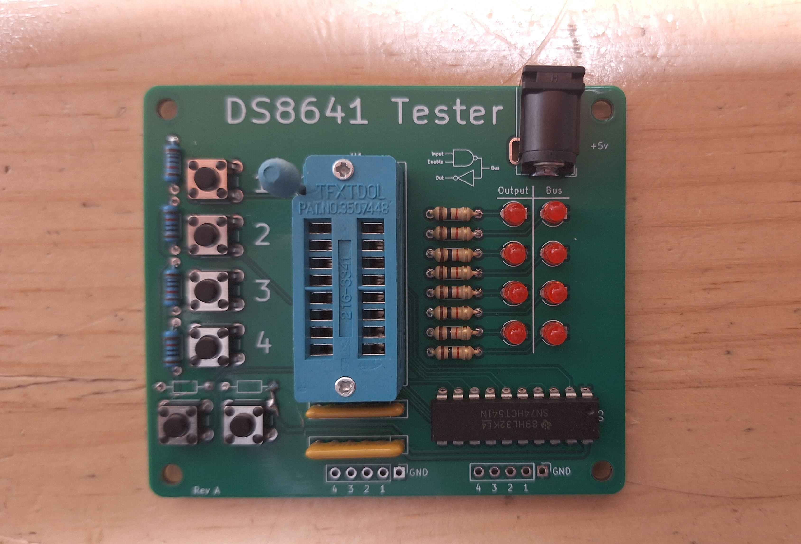

# DS8641N Tester
A simple tester for DS8641N chips.

## Usage ##
 1. Plug it into 5 volt power centre positive power.
 2. Install chip
 3. Press Buttons

## Bill of materials ##

| Quantity | Part | Link |
|:---:|:---:|:---:|
| 8 | 1K Resistor |  |
| 4 | 10K Resistor |  |
| 6 | Push Button | https://www.digikey.co.nz/en/products/detail/same-sky-formerly-cui-devices/TS02-66-70-BK-160-LCR-D/15634243 |
| 1 | Barrel Jack | https://www.digikey.co.nz/en/products/detail/same-sky-formerly-cui-devices/PJ-037A/1644545 |
| 1 | DIP-16 ZIF Socket | https://www.aliexpress.com/item/1005007048855354.html |
| 1 | 74HCT541 | https://www.digikey.co.nz/en/products/detail/texas-instruments/SN74HCT541N/277265 |
| 1 | 390ohm Bussed | https://www.digikey.co.nz/en/products/detail/bourns-inc/4606X-101-391LF/1088986 |
| 1 | 180ohm Bussed | https://www.digikey.co.nz/en/products/detail/bourns-inc/4606X-101-181LF/1088969 |
| 8 | 3mm LED RED |  |
